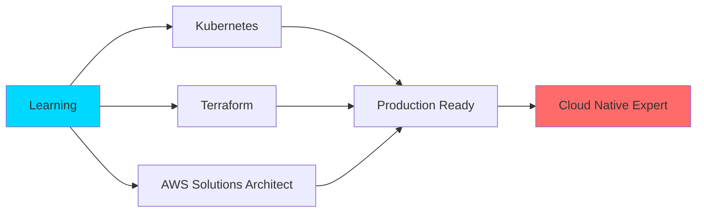

<div align="center">

<!-- Animated Header -->


<!-- Typing SVG -->
<a href="https://git.io/typing-svg"></a>

<br/>

<!-- Social Badges with Glow Effect -->
[](https://www.linkedin.com/in/vignesh-sadankae-1866b5218/)
[](mailto:vignesh.sadankae@gmail.com)
[](https://github.com/Sadanki)
[](https://goo.gl/maps/india)

<br/>

<!-- Profile Views & Stars -->

[](https://github.com/Sadanki?tab=followers)

</div>

---

<div align="center">

## 🎯 About Me

</div>

```yaml
name: Vignesh Sadanake
located_in: Hyderabad, India
current_workplace: ADP
education: ["B.Tech in Computer Science"]
fields_of_interests:
  - DevOps Engineering
  - Cloud Architecture
  - Infrastructure as Code
  - CI/CD Automation
  - Python Development
  - Open Source Contribution
currently_learning: ["Kubernetes", "Terraform", "AWS Advanced", "System Design"]
hobbies: ["Problem Solving", "Cloud Labs", "Tech Blogs", "Open Source"]
```

<div align="center">

## 🛠️ Technology Arsenal

### **Languages & Frameworks**


### **DevOps & Cloud**


### **Tools & Platforms**


</div>

---

<div align="center">

## 📊 GitHub Analytics


<!-- GitHub Trophies -->


</div>

---

<div align="center">

## 🚀 Featured Projects

</div>

<table align="center">
<tr>
<td width="50%">

### 🔧 [AWS DevOps Setup](https://github.com/Sadanki/aws-devops-setup)


Complete AWS infrastructure automation with DevOps best practices. Infrastructure as Code implementation using modern tooling.

**Key Features:**
- Infrastructure as Code
- Automated deployments
- Security configurations
- Monitoring setup

</td>
<td width="50%">

### 🔄 [CI/CD Project](https://github.com/Sadanki/ci-cd-project)


Automated CI/CD pipeline demonstrating modern DevOps practices with automated testing, builds, and deployment workflows.

**Key Features:**
- Automated testing
- Build pipelines
- Deployment automation
- Quality gates

</td>
</tr>
<tr>
<td width="50%">

### 🤖 [HR Chatbot](https://github.com/Sadanki/HR-Chatbot)


Intelligent chatbot solution for HR processes, leveraging NLP and automation to streamline HR operations.

**Key Features:**
- Natural Language Processing
- Automated responses
- Employee assistance
- Process automation

</td>
<td width="50%">

### 💻 [LeetCode 2025](https://github.com/Sadanki/leetcode_2025)


Collection of coding interview problems and solutions. Documenting the journey through algorithmic challenges.

**Key Features:**
- 50+ problems solved
- Optimized solutions
- Detailed explanations
- Interview prep

</td>
</tr>
</table>

---

<div align="center">

## 📈 Contribution Graph


## 🏆 GitHub Achievements


## 💡 Random Dev Quote


</div>

---

<div align="center">

## 🎓 Current Focus


```mermaid
graph LR
    A[Learning] --> B[Kubernetes]
    A --> C[Terraform]
    A --> D[AWS Solutions Architect]
    B --> E[Production Ready]
    C --> E
    D --> E
    E --> F[Cloud Native Expert]
    style A fill:#00D9FF
    style F fill:#FF6B6B
```

</div>

---

<div align="center">

### 💬 Let's Connect and Build Something Amazing!

> **"The best way to predict the future is to implement it."**


</div>

<!-- Snake Animation -->
<picture>
  <source media="(prefers-color-scheme: dark)" srcset="https://raw.githubusercontent.com/Sadanki/Sadanki/output/github-contribution-grid-snake-dark.svg">
  <source media="(prefers-color-scheme: light)" srcset="https://raw.githubusercontent.com/Sadanki/Sadanki/output/github-contribution-grid-snake.svg">
  
</picture>

---

<div align="center">

**Made with ❤️ and ☕ | Last Updated: January 2025**

</div>
