<div align="center">

# `$ whoami`

```yaml
name: Vignesh Sadanki
role: DevOps Engineer | Cloud Architect | Problem Solver | Software Developer
location: Hyderabad, India
company: ADP
status: Automating Everything 🚀
motto: "If it can be automated, it will be automated"
```

</div>

<div align="center">


</div>

---

## 🎯 Current Mission

```mermaid
graph LR
    A[☕ Coffee] --> B[💻 Code]
    B --> C[🧪 Test]
    C --> D[🚀 Deploy]
    D --> E[📊 Monitor]
    E --> F[🔄 Optimize]
    F --> A
    
    style A fill:#FF6B6B
    style B fill:#4ECDC4
    style C fill:#45B7D1
    style D fill:#96CEB4
    style E fill:#FFEAA7
    style F fill:#DFE6E9
```

<div align="center">



</div>

<table>
<tr>
<td width="50%">

### 🔭 What I'm Building
- **TravelMemory** - Full-stack MERN app with CI/CD
- **AWS Cost Dashboard** - Real-time monitoring & alerts
- **LeetCode Arsenal** - 100+ solutions in production-ready code
- **Automation Scripts** - Because manual is so 2019

</td>
<td width="50%">

### 🌱 Currently Learning
- Advanced Kubernetes Patterns
- System Design at Scale
- Terraform Advanced Modules
- Microservices Architecture

</td>
</tr>
</table>

---

## 💼 Professional Journey

```diff
@@ Work Experience @@
+ ADP (2019 - Present) | Analyst
  # Automated compliance operations → 40% efficiency gain
  # Built internal dashboards → Improved client satisfaction
  # Led GPT integration → Streamlined workflows
  # Tech-driven process improvements → Cross-team impact
```

<details>
<summary>📚 <b>Education & Certifications</b></summary>
<br>

| Institution | Degree | Year |
|------------|---------|------|
| **BITS Pilani** | M.Sc. Information Systems | 2024 |
| **St. Joseph's College** | B.Sc. Computer Science | 2019 |

**Certifications:** 
- ✅ DevOps & Cloud Engineering

</details>

---

## 🛠️ Tech Arsenal

<div align="center">

### 💻 Languages & Frameworks


### ☁️ Cloud & DevOps


### 🔧 Tools & Platforms


</div>

---

## 📊 GitHub Analytics

<div align="center">
  
  
</div>

<div align="center">
  
  
</div>

---

## 🧩 LeetCode Chronicles

<div align="center">

[](https://leetcode.com/Sadanki)

</div>

### 🎯 Problem Solving Patterns Mastery

```python
class ProblemSolver:
    def __init__(self):
        self.patterns = {
            'Sliding Window': {'solved': 5, 'level': '⭐⭐⭐⭐☆'},
            'Two Pointers': {'solved': 8, 'level': '⭐⭐⭐⭐⭐'},
            'Tree Traversal': {'solved': 10, 'level': '⭐⭐⭐⭐☆'},
            'Stack & Queue': {'solved': 7, 'level': '⭐⭐⭐⭐☆'},
            'Dynamic Programming': {'solved': 6, 'level': '⭐⭐⭐☆☆'},
            'Backtracking': {'solved': 4, 'level': '⭐⭐⭐☆☆'}
        }
    
    def keep_grinding(self):
        return "One problem at a time 🎯"
```

---

## 🚀 Featured Projects

<div align="center">

<table>
<tr>
<td width="50%">

### [🌍 TravelMemory](https://github.com/Sadanki/TravelMemory)
**Full-Stack MERN Application**
- 📸 Capture & share travel moments
- ☁️ Cloud deployment with CI/CD
- 🔄 Automated testing & deployment
- 📊 Real-time data synchronization

`MongoDB` `Express` `React` `Node.js` `AWS`

</td>
<td width="50%">

### [📊 AWS Cost Dashboard](https://github.com/Sadanki/Devops_Cloud_Eng_Vignesh)
**DevOps Monitoring Solution**
- 💰 Real-time cost tracking
- 📈 Resource usage analytics  
- 🚨 Automated alerts & notifications
- 📉 Time-series data visualization

`AWS` `Grafana` `Python` `Terraform`

</td>
</tr>
<tr>
<td width="50%">

### [🤖 HR-Chatbot](https://github.com/Sadanki/HR-Chatbot)
**Intelligent Automation**
- 💬 AI-powered HR assistance
- 🔄 Streamlined HR processes
- 📝 Automated query resolution
- 🎯 Enhanced employee experience

`Python` `NLP` `Machine Learning`

</td>
<td width="50%">

### [💡 LeetCode 2025](https://github.com/Sadanki/leetcode_2025)
**Algorithmic Solutions Library**
- 🧠 100+ problems solved
- 🎨 Multiple language implementations
- 📚 Detailed explanations
- 🔍 Pattern-based organization

`Java` `Python` `JavaScript`

</td>
</tr>
</table>

</div>

---

## 📈 Contribution Heatmap

<div align="center">


</div>

---

## 🏆 Achievements Unlocked

<div align="center">


</div>

---

## 📝 Latest Thoughts & Writings

<!-- BLOG-POST-LIST:START -->
> 🔄 **Coming Soon**: How I Automated My Entire Development Workflow
> 
> 🔄 **Coming Soon**: From LeetCode to Production - Deploying Algorithms as Microservices
>
> 🔄 **Coming Soon**: Kubernetes Concepts Explained Through Binary Trees
>
> 🔄 **Coming Soon**: AWS Cost Optimization - The Complete Guide
<!-- BLOG-POST-LIST:END -->

---

## 🎨 System Design Philosophy

<div align="center">


</div>

---

## 🎯 2025 Goals Tracker

<div align="center">

| Goal | Progress | Status |
|------|----------|--------|
| 🧩 Solve 200+ LeetCode Problems | `███████░░░` 75/200 | 🔥 In Progress |
| ☁️ AWS Solutions Architect Cert | `████████░░` 80% | 📚 Studying |
| 📝 Publish 12 Technical Blogs | `██░░░░░░░░` 2/12 | ✍️ Writing |
| 🚀 Deploy 5 Production Projects | `██████░░░░` 3/5 | 🛠️ Building |
| 🌟 Contribute to 10 Open Source Projects | `████░░░░░░` 4/10 | 🤝 Active |

</div>

---

## 📫 Let's Connect & Build Something Amazing!

<div align="center">

[](https://github.com/Sadanki)
[](https://linkedin.com/in/vignesh-sadanki)
[](mailto:Sadanki190@gmail.com)
[](https://leetcode.com/Sadanki)

</div>

---

<div align="center">

### 💭 Daily Mantra

```javascript
while (alive) {
    eat();
    sleep();
    code();
    repeat();
}
```


---

### ⚡ Fun Fact

**I can deploy a Kubernetes cluster faster than I can decide what to have for lunch** 🚀🥗

---

<sub>Built with ❤️ and ☕ | Last Updated: Auto-sync via GitHub Actions</sub>

</div>
